# 📸 Pitora  

**Pitora is a photo curation app** that lets users search for images, save them to collections, add tags to images, and even track their search history.  

## 🛠 Tech Stack & Dependencies  

**Backend:**  
- Express.js - For server setup  
- Sequelize - Database ORM  
- SQLite - Lightweight database  
- Axios - For API calls  
- Jest & Supertest - For testing  
- dotenv - For managing environment variables  
- CORS - To allow cross-origin requests
- Unplash - create an account on unplash after that create application and get the access key and store api's key .env file

### 📦 **Installed Packages**  
  axios,
  cors,
  dotenv,
  express,
  jest,
  sequelize,
  sequelize-cli,
  sqlite3,
  supertest,

### 🚀 How to Set Up for this project ?
1️⃣ Clone the Project
```sh
git clone https://github.com/Mohdsohail7/pitora.git
```
cd pitora

2️⃣ Install Dependencies
this command all dependencies in your project
```sh
npm install
```

3️⃣ Set Up the Database
```sh
npx sequelize-cli db:migrate
```
```sh
npx sequelize-cli db:seed:all
```

4️⃣ Start the Server
```sh
npm start
``` 
this command start your server

### 🧪 How to Run Tests?
```sh
npm test
``` 
This will run API tests using Jest and Supertest.

### API Endpoints

### Create new user
#### API Spec:

#### Type: POST

**API Endpoint:**
``` sh
http://localhost:3000/api/users
```
Request:
``` sh
{
  "username": "sohail",
  "email": "sohail12@example.com"
}
```
Expected Response:
``` sh 
{
    'message': 'User created successfully',
    'user': {
        'id': 1,
        'username': 'sohail',
        'email': 'sohail12@example.com',
        'updatedAt': '2024-10-21T10:58:08.408Z',
        'createdAt': '2024-10-21T10:58:08.408Z'
    }
}
```
***Validations:***
Make sure there are no users with the same email in the request body:

Error:
```sh
{
    "error": "User already exists with this email. Please try to new email."
}
```
Validate if the client has sent both username & email in the request body:

Error:
```sh
{
    "error": "Username or Email are required"
}
```
Validate if the email is a valid email address that includes both @ and .
```sh
{
    "error": "Invalid Email format. Please check @ or . added in your email"
}
```

### Search Photo
#### API Spec:

#### Type: GET
### Query Parameters: nature

**API Endpoint:**
``` sh
http://localhost:8000/api/search/photos?query=nature
```
Expected Response:
``` sh
{
    "photos": [
        {
            "imageUrl": {
                "raw": "https://images.unsplash.com/photo-1465146344425-f00d5f5c8f07?ixid=M3w2NzYzMjJ8MHwxfHNlYXJjaHwxfHxuYXR1cmV8ZW58MHx8fHwxNzM5Nzk4NTc2fDA&ixlib=rb-4.0.3",
                "full": "https://images.unsplash.com/photo-1465146344425-f00d5f5c8f07?crop=entropy&cs=srgb&fm=jpg&ixid=M3w2NzYzMjJ8MHwxfHNlYXJjaHwxfHxuYXR1cmV8ZW58MHx8fHwxNzM5Nzk4NTc2fDA&ixlib=rb-4.0.3&q=85",
                "regular": "https://images.unsplash.com/photo-1465146344425-f00d5f5c8f07?crop=entropy&cs=tinysrgb&fit=max&fm=jpg&ixid=M3w2NzYzMjJ8MHwxfHNlYXJjaHwxfHxuYXR1cmV8ZW58MHx8fHwxNzM5Nzk4NTc2fDA&ixlib=rb-4.0.3&q=80&w=1080",
                "small": "https://images.unsplash.com/photo-1465146344425-f00d5f5c8f07?crop=entropy&cs=tinysrgb&fit=max&fm=jpg&ixid=M3w2NzYzMjJ8MHwxfHNlYXJjaHwxfHxuYXR1cmV8ZW58MHx8fHwxNzM5Nzk4NTc2fDA&ixlib=rb-4.0.3&q=80&w=400",
                "thumb": "https://images.unsplash.com/photo-1465146344425-f00d5f5c8f07?crop=entropy&cs=tinysrgb&fit=max&fm=jpg&ixid=M3w2NzYzMjJ8MHwxfHNlYXJjaHwxfHxuYXR1cmV8ZW58MHx8fHwxNzM5Nzk4NTc2fDA&ixlib=rb-4.0.3&q=80&w=200",
                "small_s3": "https://s3.us-west-2.amazonaws.com/images.unsplash.com/small/photo-1465146344425-f00d5f5c8f07"
            },
            "description": null,
            "altDescription": "orange flowers"
        },
        {
            "imageUrl": {
                "raw": "https://images.unsplash.com/photo-1518495973542-4542c06a5843?ixid=M3w2NzYzMjJ8MHwxfHNlYXJjaHwyfHxuYXR1cmV8ZW58MHx8fHwxNzM5Nzk4NTc2fDA&ixlib=rb-4.0.3",
                "full": "https://images.unsplash.com/photo-1518495973542-4542c06a5843?crop=entropy&cs=srgb&fm=jpg&ixid=M3w2NzYzMjJ8MHwxfHNlYXJjaHwyfHxuYXR1cmV8ZW58MHx8fHwxNzM5Nzk4NTc2fDA&ixlib=rb-4.0.3&q=85",
                "regular": "https://images.unsplash.com/photo-1518495973542-4542c06a5843?crop=entropy&cs=tinysrgb&fit=max&fm=jpg&ixid=M3w2NzYzMjJ8MHwxfHNlYXJjaHwyfHxuYXR1cmV8ZW58MHx8fHwxNzM5Nzk4NTc2fDA&ixlib=rb-4.0.3&q=80&w=1080",
                "small": "https://images.unsplash.com/photo-1518495973542-4542c06a5843?crop=entropy&cs=tinysrgb&fit=max&fm=jpg&ixid=M3w2NzYzMjJ8MHwxfHNlYXJjaHwyfHxuYXR1cmV8ZW58MHx8fHwxNzM5Nzk4NTc2fDA&ixlib=rb-4.0.3&q=80&w=400",
                "thumb": "https://images.unsplash.com/photo-1518495973542-4542c06a5843?crop=entropy&cs=tinysrgb&fit=max&fm=jpg&ixid=M3w2NzYzMjJ8MHwxfHNlYXJjaHwyfHxuYXR1cmV8ZW58MHx8fHwxNzM5Nzk4NTc2fDA&ixlib=rb-4.0.3&q=80&w=200",
                "small_s3": "https://s3.us-west-2.amazonaws.com/images.unsplash.com/small/photo-1518495973542-4542c06a5843"
            },
            "description": "Finding my roots",
            "altDescription": "sun light passing through green leafed tree"
        },
        ....
    ]
}
```
*** Validations:***
Validate that the query parameter is provided in the request. If missing, return a 400 error with a message indicating that a search term is required.
``` sh
{
    "message": "search term is required."
}
```
Handle cases where the search returns no results by returning an appropriate message like 'No images found for the given query.'
``` sh
{
    "message": "No images found for the given query."
}
```

### Save Photo in Collection
#### API Spec:

#### Type: POST

**API Endpoint:**
``` sh
http://localhost:8000/api/photos
```
Request:
``` sh
{
  "imageUrl": "https://images.unsplash.com/photo-1480497490787-505ec076689f",
  "description": "Beautiful landscape",
  "altDescription": "Mountain view",
  "tags": ["water", "waterfall", "mountain"],
  "userId": 1
}
```
Expected Response:
``` sh
{
    "message": "Photo saved successfully."
}
```
*** Validations:***
Use the JavaScript startsWith() method to validate that the imageUrl is from Unsplash.
If the URL is invalid, return a 400 error response with a message like Invalid image URL.
``` sh 
{
    "message": "Invalid image URL."
}
```
Ensure that no more than 5 tags are provided for one photo.
``` sh
{
    "error": "tags limit exceeds. no more than 5 tags."
}
```
Each tag must not exceed 20 characters in length.
``` sh
{
    "error": "tag characters limit exceeds."
}
```

### Adding Tags for Photos
#### API Spec:

#### Type: POST

**API Endpoint:**
``` sh
http://localhost:8000/api/photos/:photoId/tags
```
Request:
``` sh
{
  "tags": ["helloTag1"]
}
```
Expected Response:
```sh
{
    "message": "Tags added successfully"
}
```
***Validations:***
Maximum Tags:
```sh
{
    "error": "Cannot add more than 5 tags to a photo."
}
```
Ensure each tag is a non-empty string.
```sh
{
    "error": "Tags must be non-empty strings."
}
```

### Searching Photos by Tags and Sorting by Date Saved
#### API Spec:

#### Type: GET

**API Endpoint:**
``` sh
http://localhost:8000/api/photos/tag/search?tags=advanture&sort=DESC&userId=1
```
Expected Response:
``` sh
{
    "photos": [
        {
            "imageUrl": "https://images.unsplash.com/photo-1480497490787-505ec076689f",
            "description": "Beautiful landscape",
            "altDescription": "Mountain view",
            "dateSaved": "2024-11-20T06:47:57.182Z",
            "tags": [
                "advanture",
                "travell"
            ]
        }
    ]
}
```
*** Validations:***
Only a single tag is accepted as input query.
```sh
{
    "error": "Only a single tag is allowed. Multiple tags are not accepted."
}
```

### Tracking and Displaying Search History
#### API Spec:

#### Type: GET

**API Endpoint:**
```sh
http://localhost:8000/api/search-history?userId=1
```
Expected Response:
```sh
{
    "searchHistory": [
        {
            "id": 29,
            "query": "water",
            "userId": 1,
            "timestamp": "2025-02-17T14:43:29.751Z",
            "createdAt": "2025-02-17T14:43:29.751Z",
            "updatedAt": "2025-02-17T14:43:29.751Z"
        },
        {
            "id": 28,
            "query": "mountain",
            "userId": 1,
            "timestamp": "2025-02-17T14:43:18.662Z",
            "createdAt": "2025-02-17T14:43:18.662Z",
            "updatedAt": "2025-02-17T14:43:18.662Z"
        },
        {
            "id": 27,
            "query": "water",
            "userId": 1,
            "timestamp": "2025-02-17T14:43:00.792Z",
            "createdAt": "2025-02-17T14:43:00.792Z",
            "updatedAt": "2025-02-17T14:43:00.792Z"
        },
        {
            "id": 26,
            "query": "advanture",
            "userId": 1,
            "timestamp": "2025-02-17T14:42:38.371Z",
            "createdAt": "2025-02-17T14:42:38.371Z",
            "updatedAt": "2025-02-17T14:42:38.371Z"
        }, 
        ....
    ]
}
```
*** Validations:***
User id:
```sh
{
    "error": "No past search history found for this user."
}
```
Search Queries:
```sh
{
    "error": "User id is missing"
}
```
### Screenshots of the projects
### Create a new user.
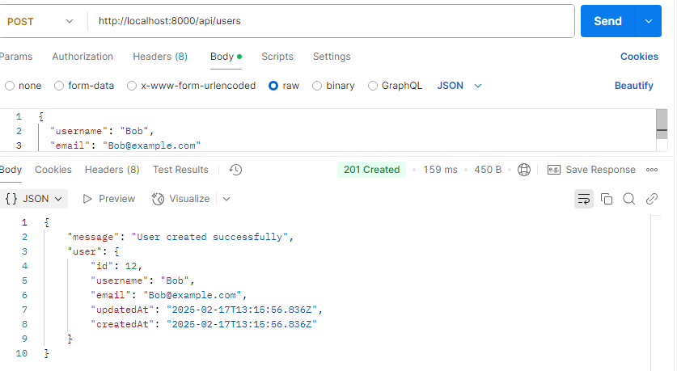

### Error Handling (400): in create User
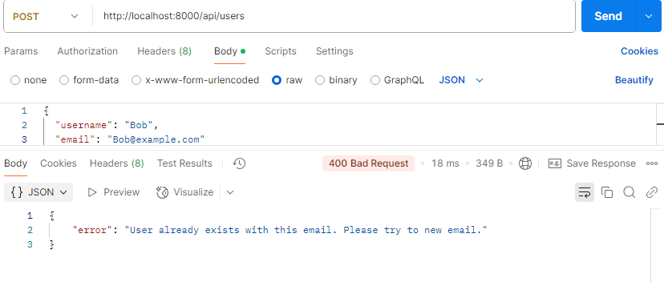
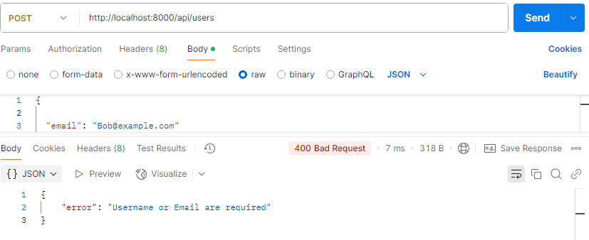
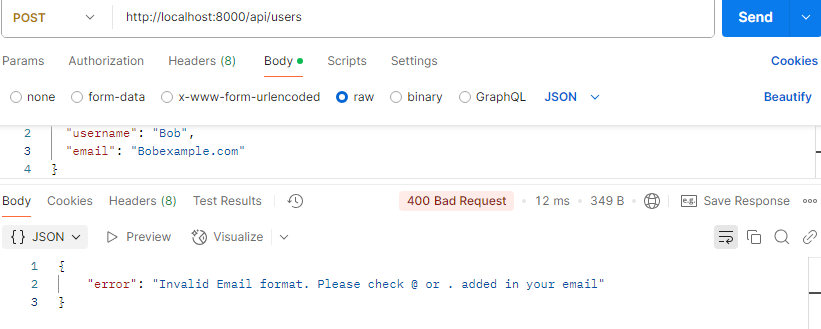

### Making API Calls to Unsplash
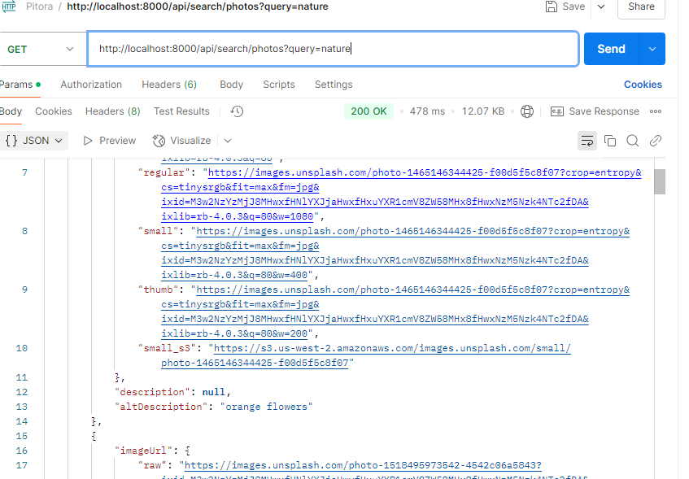

### Error Handling (400) or (404): Making API Calls to Unsplash
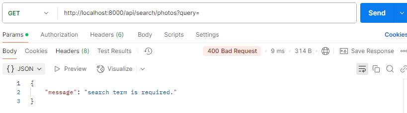
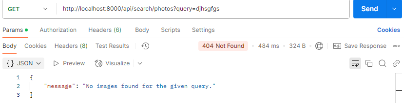

### Saving Photos into Collections
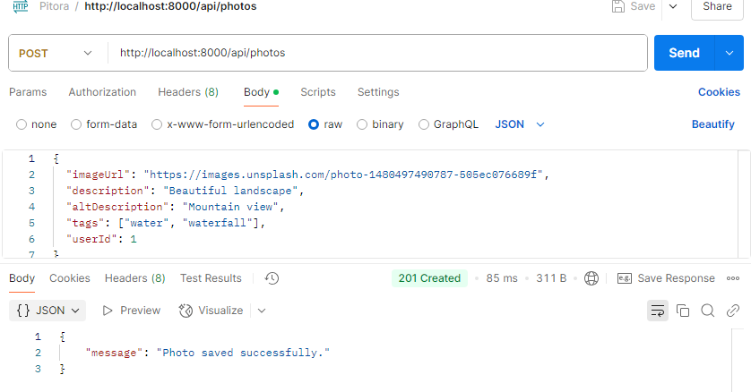

### Error Handling (400): 
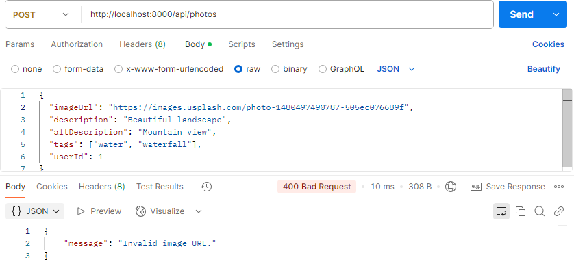
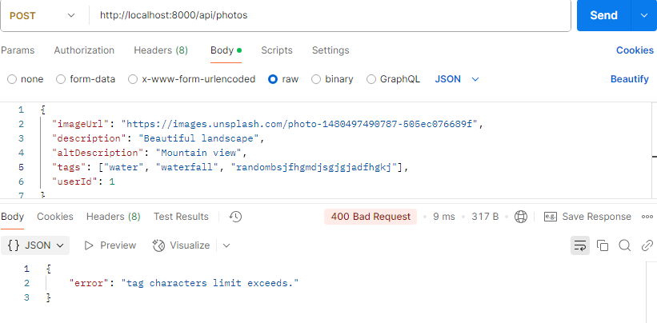
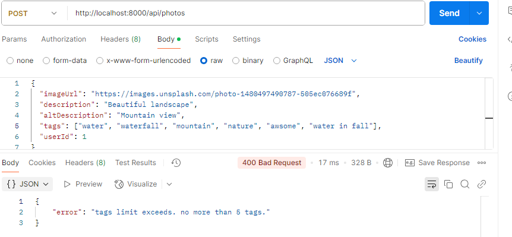

### Retrieve all photos
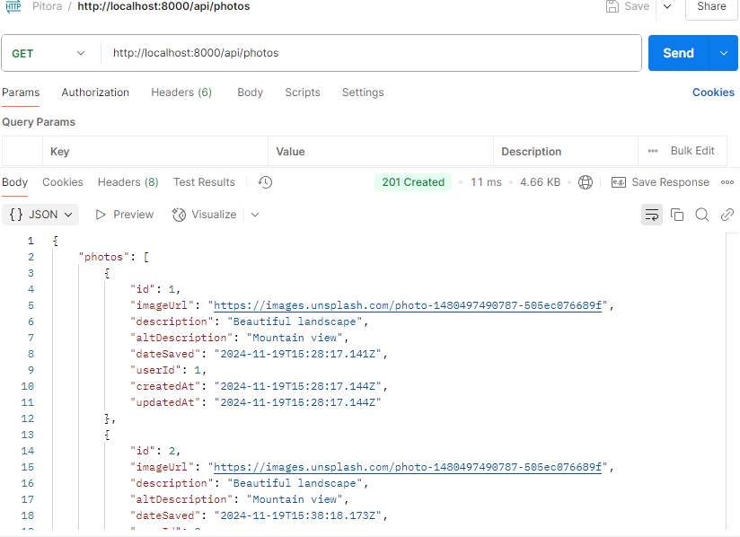

### Adding Tags for Photos
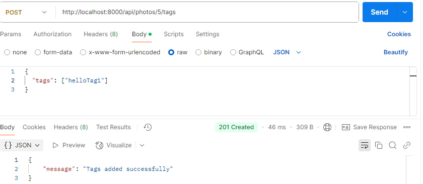

### Error Handling (400): 
Maximum Tags:
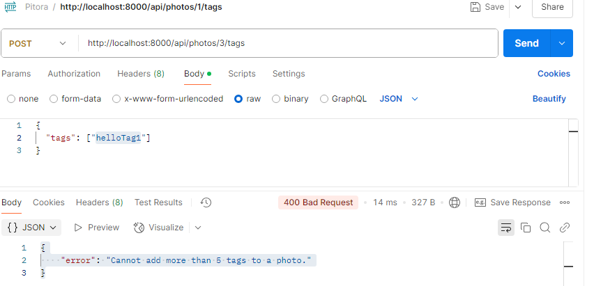
Tag Validation:
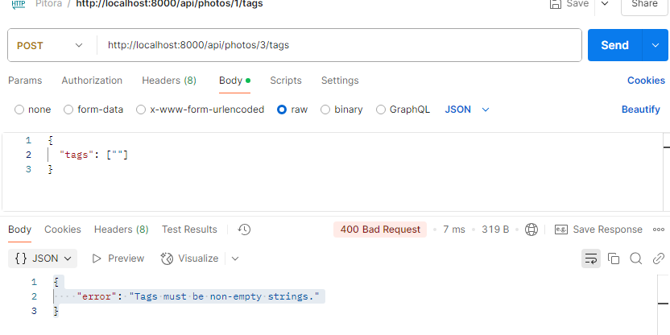

### Searching Photos by Tags and Sorting
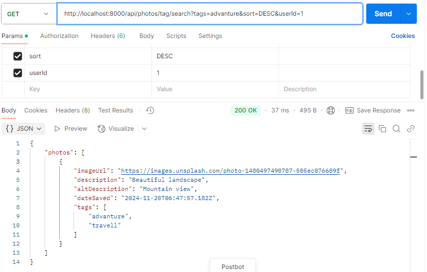

### Error Handling (400): 
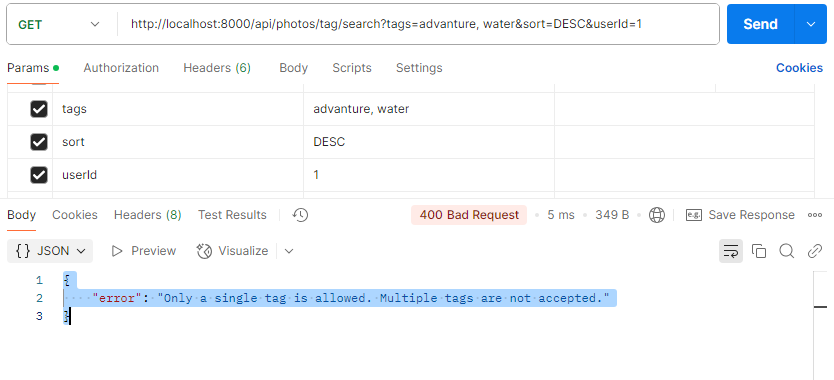

### Tracking and Displaying Search History
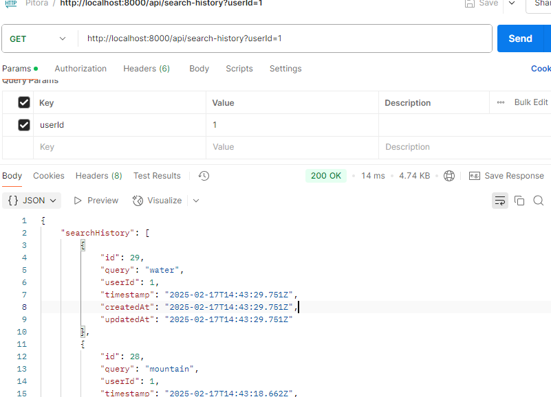

### Error Handling (400) or (404):
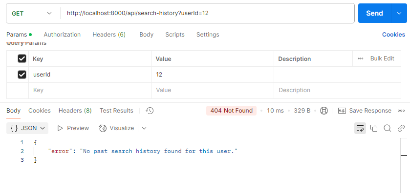
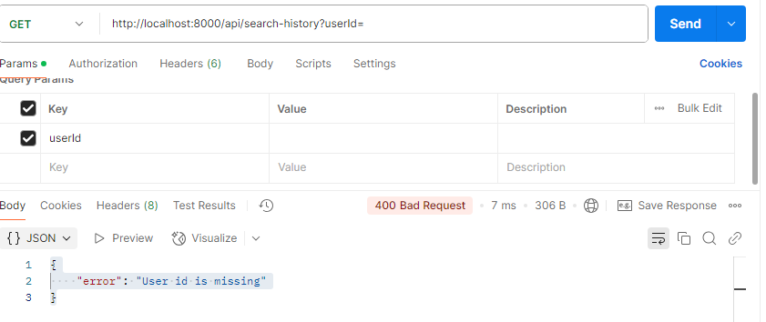


### 📌 Features
✅ Search and save images

✅ Manage collections and tags

✅ Track search history

✅ Secure and fast backend


🤝 Contributing
If you want to contribute or add new features, feel free to submit a pull request! 😊

 If you like this project, don't forget to give it a ⭐! 😃

📜 License
This project is licensed under the MIT License.


